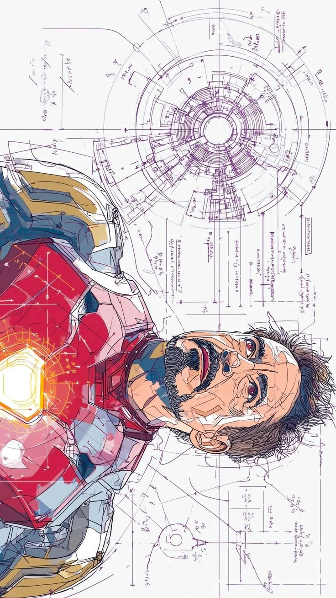
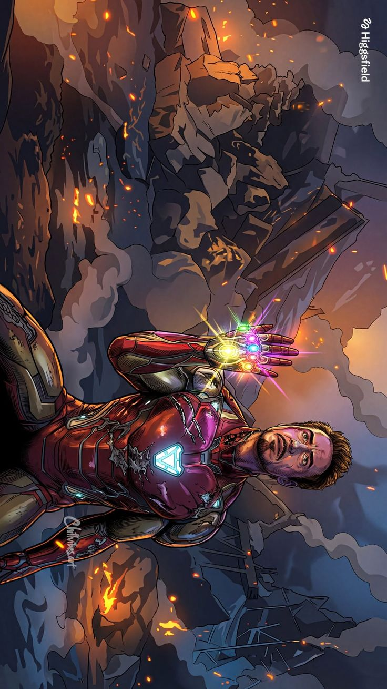
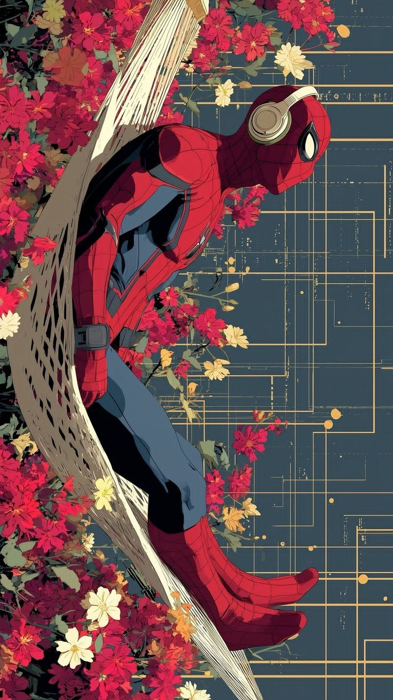
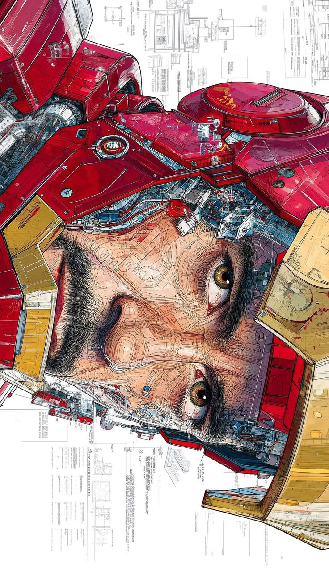
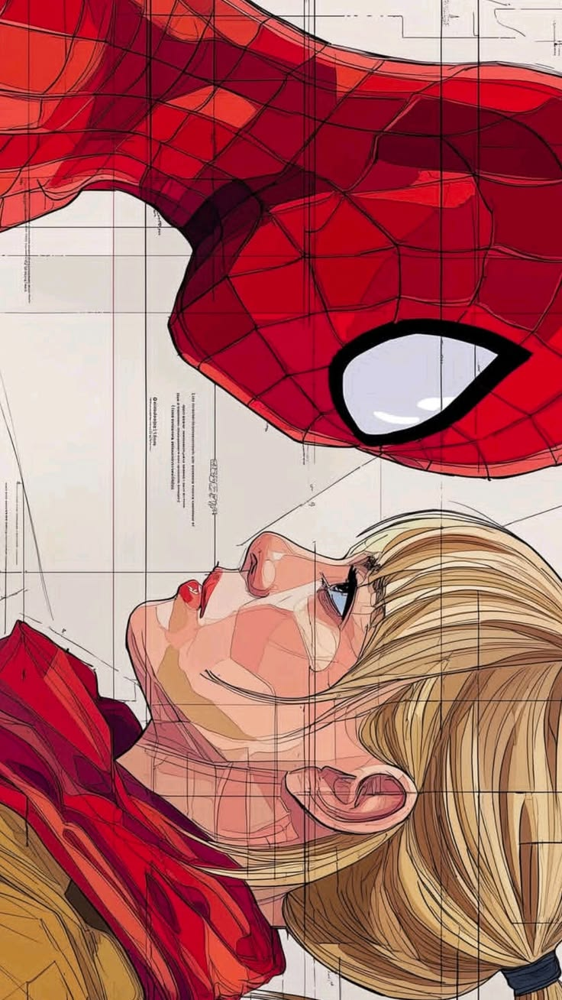

  
  <h1>UI VAULT</h1>
  
<strong>Collect • Remix • Reuse</strong>

 

**UI Vault** is a high-contrast, Neo-Brutalist (Comic-Style) component gallery and UI inspiration board. It provides a unique, highly stylized digital environment designed to showcase, collect, and explore custom interface design.

---

## 🖼️ The Showcase

A glimpse into the visual aesthetic powering the Vault:

| High-Contrast UI | Comic-Style Themes |
| :---: | :---: |
|  |  |
|  |  |

---

## 🚀 Concept & Vision
Rather than a standard component dashboard, UI Vault is built as an immersive interactive experience. The design philosophy embraces classic comic book printing aesthetics, merging them with modern web interactions to create a loud, unapologetic UI environment.

Key aesthetic pillars include:
- **Authentic Comic-Style Theme:** Heavy inking borders (3px), deep drop shadows (6px+), classic halftone dot backgrounds, and ultra-vibrant interactive states.
- **Dynamic Component Library:** Dozens of UI design categories (Glass, Minimal, Neon, Cards, Retro, etc.) organized through a clean, horizontally scrollable tag interface.
- **Infinite Scrolling Background:** A massive, smooth-scrolling ambient background gallery displaying raw UI inspiration boards with a high-contrast cinematic overlay.
- **Magnetic UX:** Silky smooth, physics-based magnetic hovering effects on key navigation and layout elements.
- **Tactile Interaction:** Components instantly react to user input by depressing their heavy drop shadows, resulting in a deeply tactile, mechanical feeling.

## 🎨 Design Philosophy
The Vault treats UI elements not just as code snippets, but as digital artifacts. The environment uses exaggerated typography and aggressive shapes to elevate simple buttons and cards into bold, statement-making design pieces. 

By utilizing stark black-and-white halftones contrasted aggressively against pop-art accent colors (like bright yellow), UI Vault bridges the gap between conventional frontend web development and classic graphic novel illustration.
